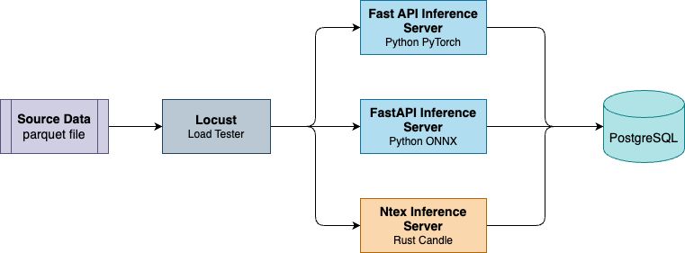

# Python vs. Rust Deep Learning Inference Performance

Hi there 🙌. As ML practitioners, we typically use Python to deploy models with PyTorch or the ONNX Runtime. Although these runtimes are implemented in *C++*, the Python layer still introduces overhead that can significantly reduce performance. How much does this overhead actually cost us?

In this project, I compare these frameworks to demonstrate the cost of Python overhead.

1. **Python PyTorch**
2. **Python ONNX**
3. **[Rust Candle]** (deep learning framework in Rust)

**TL;DR**

Below are the load-testing results with the inference container capped at 2 cores / 2 GB:

| Metrics             | Python PyTorch   | Python ONNX      | Rust Candle      | Winner          |
| :--                 | :--:             | :--:             | :--:             | :--:            |
| Resource usage      | 2 cores / 680 MB | 2 cores / 680 MB | 0.7 core / 17 MB | **Rust Candle** |
| P95 latency [ms]    | 95               | 200              | 20               | **Rust Candle** |
| P99 latency [ms]    | 130              | 280              | 23               | **Rust Candle** |
| Requests per second | 222.5            | 80.1             | 994.4            | **Rust Candle** |

**Rust Candle is the clear winner here 🚀.** Note that the Rust server did not fully utilize CPU (only 0.7 of 2 cores) due to a database bottleneck. The database was capped at 3 cores / 2 GB and, for Rust Candle, CPU utilization hit 100%. This suggests Rust Candle could achieve even higher RPS by increasing database resources.

For Python, the bottleneck is the Python layer itself (using all 2 cores), while database CPU utilization is only ~30%.

## Project settings

### Architecture

The architecture is as shown below:



To make it more realistic, the inference server fetches features from a PostgreSQL database, then feeds the features into the deep learning model and returns results as JSON.

### Deep learning model

A small RankNet model is used as a toy model to test performance:

```text
Input: 40 features
Layer 1: Dense Neural Network; (40 x 256)
Layer 2: Dense Neural Network; (256 x 128)
Layer 3: Dense Neural Network; (128 x 1)
```

Total parameters: `43,521`.

## Quick setup

Use the following commands to reproduce the results:

1. Install [Just]; the project scripts are in the `Justfile`.
2. Run `just dump-data` to dump mock data into the database.
3. Run `just run-python-pytorch-load-tester` to run load testing on Python PyTorch. The results will be stored at `./data/python-pytorch-load-tester-results.csv`.
4. Run `just run-python-onnx-load-tester` to run load testing on Python ONNX. The results will be stored at `./data/python-onnx-load-tester-results.csv`.
5. Run `just run-rust-load-tester` to run load testing on Rust Candle. The results will be stored at `./data/rust-load-tester-results.csv`.

## Machine spec

- OS: macOS
- Chip: M4 Max

## Results

### Python PyTorch 🚔

Details for Python PyTorch load testing.

Summary:
| Metric                 | Value               |
| :--                    | :--                |
| Median response time   | 38 ms               |
| Average response time  | 43.89 ms |
| Min response time      | 10.24 ms  |
| Max response time      | 322.70 ms |
| Requests/s             | 222.46    |
| Failures/s             | 0.0                 |

Latency percentiles [ms]:
| 50% | 66% | 75% | 80% | 90% | 95% | 98% | 99% | 99.9% | 99.99% | 100% |
| :--:| :--:| :--:| :--:| :--:| :--:| :--:| :--:| :--:  | :--:   | :--: |
| 38  | 50  | 56  | 60  | 73  | 95  | 110 | 130 | 200   | 320    | 320  |

### Python ONNX 🐢

Details for Python ONNX load testing.

Summary:
| Metric                 | Value                |
| :--                    | :--                 |
| Median response time   | 97 ms                |
| Average response time  | 122.51 ms  |
| Min response time      | 8.50 ms  |
| Max response time      | 60238.22 ms  |
| Requests/s             | 80.12       |
| Failures/s             | 0.58    |

Latency percentiles [ms]:
| 50% | 66% | 75% | 80% | 90% | 95% | 98% | 99% | 99.9% | 99.99% | 100% |
| :--:| :--:| :--:| :--:| :--:| :--:| :--:| :--:| :--:  | :--:   | :--: |
| 97  | 100 | 110 | 120 | 190 | 200 | 220 | 280 | 330   | 60000  | 60000 |

### Rust Candle 🚀

Details for Rust Candle load testing.

Summary:
| Metric                 | Value               |
| :--                    | :--                |
| Median response time   | 8 ms                |
| Average response time  | 9.55 ms |
| Min response time      | 3.14 ms |
| Max response time      | 402.32 ms  |
| Requests/s             | 994.40    |
| Failures/s             | 0.0                 |

Latency percentiles [ms]:
| 50% | 66% | 75% | 80% | 90% | 95% | 98% | 99% | 99.9% | 99.99% | 100% |
| :--:| :--:| :--:| :--:| :--:| :--:| :--:| :--:| :--:  | :--:   | :--: |
| 8   | 9   | 9   | 9   | 15  | 20  | 22  | 23  | 41    | 240    | 400  |


[Just]: https://github.com/casey/just?tab=readme-ov-file#cross-platform
[Rust Candle]: https://github.com/huggingface/candle
